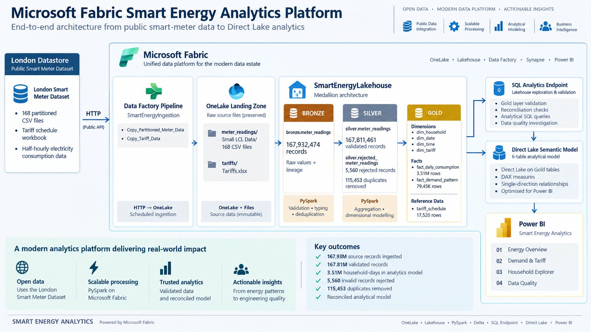
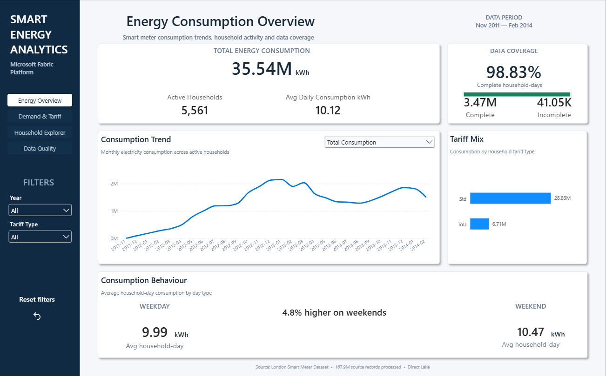
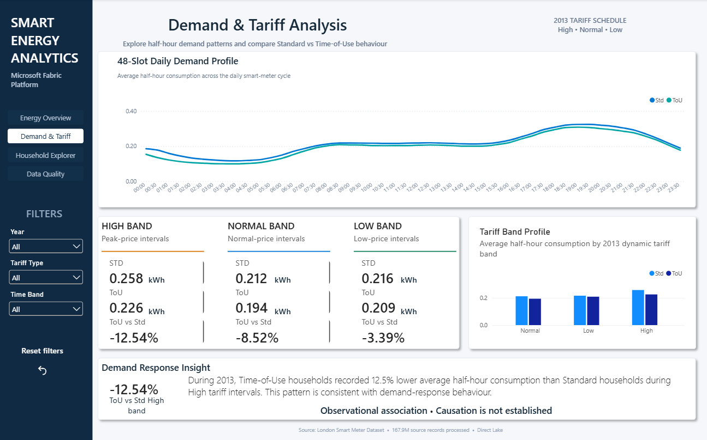
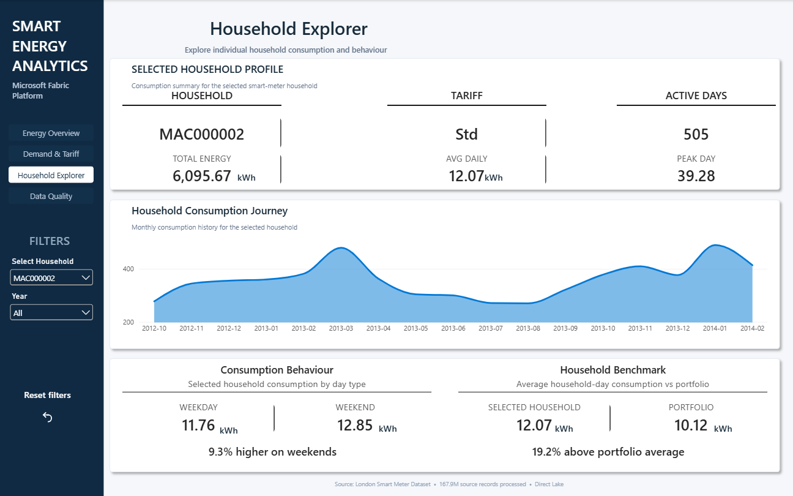
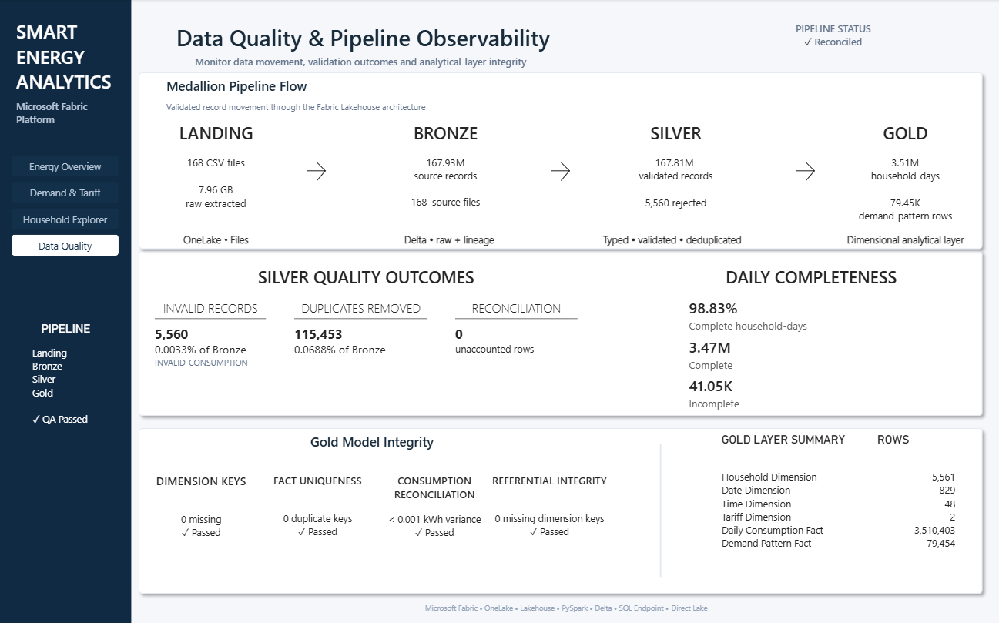
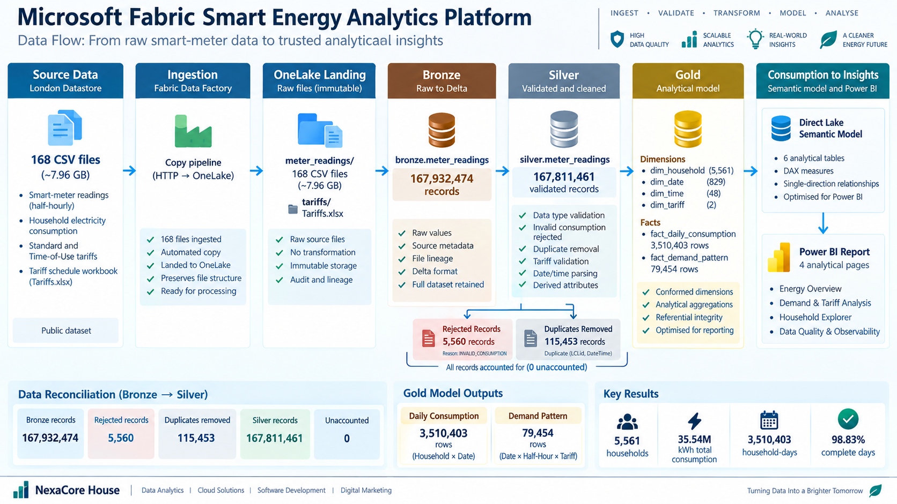

# Microsoft Fabric Analytics Platform

An end-to-end Microsoft Fabric analytics platform processing **167.9 million smart-meter readings** through Data Factory, OneLake, Lakehouse, PySpark, Delta, SQL, Direct Lake and Power BI.

The project demonstrates how large-scale raw energy-consumption data can be ingested, validated, transformed and modelled into trusted analytical datasets for household consumption, demand-pattern and tariff analysis.

---

## Project Highlights

| Metric | Result |
|---|---:|
| Source files | 168 CSV files |
| Extracted source size | ~7.96 GB |
| Bronze records | 167,932,474 |
| Silver records | 167,811,461 |
| Rejected records | 5,560 |
| Duplicate records removed | 115,453 |
| Households | 5,561 |
| Total validated consumption | 35.54M kWh |
| Daily Consumption fact | 3,510,403 rows |
| Demand Pattern fact | 79,454 rows |
| Complete household-days | 98.83% |
| Missing Gold dimension keys | 0 |
| Duplicate Gold fact-grain keys | 0 |

---

## Architecture



The implemented architecture is:

`London Datastore → Fabric Data Factory → OneLake Landing → Bronze → Silver → Gold`

From the Gold layer:

`Gold → SQL Analytics Endpoint → Validation & Exploration`

and:

`Gold → Direct Lake Semantic Model → Power BI`

The SQL Analytics Endpoint is used for read-only validation and analytical exploration. It is not an intermediate transformation layer between Gold and Power BI.

---

## Technology Stack

- Microsoft Fabric
- Fabric Data Factory
- OneLake
- Fabric Lakehouse
- PySpark
- Delta
- SQL Analytics Endpoint
- Direct Lake
- Power BI
- DAX
- Dimensional Modelling

---

## Business Scenario

Smart-meter data is generated at a much finer grain than conventional business reporting datasets.

The source contains half-hourly electricity readings across thousands of London households and presents several engineering challenges:

- Large data volume
- Multiple source files
- Invalid consumption values
- Duplicate meter readings
- Partial household-days
- Standard and Time-of-Use household groups
- Dynamic tariff periods
- Multiple analytical grains

The solution therefore goes beyond dashboard creation and implements an end-to-end analytical platform from source ingestion through reporting.

---

## Medallion Architecture

### Landing

Fabric Data Factory ingests the public source data into OneLake.

The implemented landing dataset contains:

- 168 CSV files
- ~7.96 GB extracted source data
- Separate tariff reference workbook

### Bronze

`bronze.meter_readings`

The complete source dataset is persisted as Delta with source lineage and ingestion metadata.

**167,932,474 rows**

### Silver

`silver.meter_readings`

Silver applies:

- Type conversion
- Consumption validation
- Timestamp validation
- Tariff validation
- Business-key deduplication
- Derived date/time attributes
- Source-lineage retention

Result:

**167,811,461 validated readings**

Rejected records are retained separately in:

`silver.rejected_meter_readings`

### Gold

The Gold layer provides conformed dimensions and two purpose-built analytical facts.

#### Daily Consumption

**Grain:** Household × Date  
**Rows:** 3,510,403

Designed for household behaviour, daily trends, completeness and portfolio benchmarking.

#### Demand Pattern

**Grain:** Date × Half-Hour × Tariff  
**Rows:** 79,454

Designed for intraday demand, Standard vs Time-of-Use analysis and dynamic tariff-band analysis.

---

## Data Quality

Data quality is explicitly incorporated into the transformation pipeline.

Bronze-to-Silver reconciliation:

| Outcome | Rows |
|---|---:|
| Bronze | 167,932,474 |
| Rejected | 5,560 |
| Duplicates removed | 115,453 |
| Silver | 167,811,461 |
| Unaccounted difference | 0 |

Additional QA results:

- 0 duplicate Silver business keys
- 0 invalid Silver consumption rows after validation
- 0 invalid Silver tariff rows
- 0 missing Gold dimension references
- 0 duplicate Gold fact-grain keys
- 98.83% complete household-days

Silver and both Gold facts reconcile to approximately **35.54 million kWh**, with only negligible floating-point aggregation variance.

---

## Power BI Report

The final Power BI solution is a thin report connected to a Direct Lake semantic model.

### 1. Energy Consumption Overview



Provides overall energy KPIs, consumption trends, tariff mix, data coverage and weekday/weekend behaviour.

---

### 2. Demand & Tariff Analysis



Analyses the 48 half-hour demand profile and compares Standard and Time-of-Use household behaviour.

For the 2013 dynamic tariff schedule, ToU households recorded lower average half-hour consumption than Standard households across all three bands:

| Band | ToU vs Std |
|---|---:|
| High | -12.54% |
| Normal | -8.52% |
| Low | -3.39% |

These results are observational and do not establish that tariff pricing caused the measured differences.

---

### 3. Household Explorer



Supports single-household exploration including:

- Consumption KPIs
- Monthly consumption journey
- Weekday/weekend behaviour
- Portfolio benchmarking

---

### 4. Data Quality & Pipeline Observability



Surfaces engineering outcomes including:

- Landing, Bronze, Silver and Gold volumes
- Rejected records
- Duplicate removals
- Daily completeness
- Gold model integrity
- Reconciliation status

---

## Semantic Model

The Direct Lake semantic model contains:

### Dimensions

- Date
- Time
- Tariff
- Household

### Facts

- Daily Consumption
- Demand Pattern

The model uses six active one-to-many, single-direction relationships.

Bronze, Silver and engineering reference tables are deliberately excluded from the reporting model.

Demand averages use weighted calculation logic:

`SUM(TotalConsumptionKWh) / SUM(ReadingCount)`

rather than an unweighted average of pre-aggregated averages.

---

## SQL Analytics

SQL is used alongside PySpark for independent validation and analytical exploration through the Fabric SQL Analytics Endpoint.

The repository contains:

```text
sql/
├── 01_gold_model_validation.sql
├── 02_energy_consumption_analysis.sql
├── 03_demand_pattern_analysis.sql
└── 04_data_quality_validation.sql
```

PySpark remains responsible for the main engineering transformations.

---

## Fabric Notebooks

The engineering workflow is documented through 12 notebooks:

```text
notebooks/
├── 01_development_source_profiling.ipynb
├── 02_development_silver_validation.ipynb
├── 03_landing_inspection.ipynb
├── 04_bronze_delta_ingestion.ipynb
├── 05_silver_full_transformation.ipynb
├── 06_silver_data_quality.ipynb
├── 07_silver_profiling_performance.ipynb
├── 08_gold_dimensions.ipynb
├── 09_gold_fact_daily_consumption.ipynb
├── 10_gold_fact_demand_pattern.ipynb
├── 11_gold_model_qa.ipynb
└── 12_tariff_reference_profiling.ipynb
```

The notebooks cover development profiling, full-scale transformation, validation, dimensional modelling, tariff enrichment and Gold QA.

---

## Data Flow



The platform progressively converts raw source files into reporting-oriented analytical datasets while retaining the validated reading-level data in Silver.

---

## Repository Structure

```text
microsoft-fabric-analytics-platform/
│
├── README.md
├── .gitignore
│
├── architecture/
│   ├── fabric-analytics-architecture.png
│   └── fabric-data-flow.png
│
├── notebooks/
│   └── 12 Fabric PySpark notebooks
│
├── sql/
│   └── 4 SQL validation and analysis scripts
│
├── powerbi/
│   ├── README.md
│   └── screenshots/
│       ├── 01_energy-overview.png
│       ├── 02_demand-tariff.png
│       ├── 03_household-explorer.png
│       └── 04_data-quality.png
│
├── docs/
│   ├── business-requirements.md
│   ├── architecture.md
│   ├── lakehouse-design.md
│   ├── data-dictionary.md
│   ├── data-quality.md
│   ├── semantic-model.md
│   ├── technical-decisions.md
│   └── insights.md
│
└── data/
    ├── README.md
    └── sample/
        └── smart_meter_sample.csv
```

---

## Documentation

Detailed project documentation is available in the `docs/` directory:

- [Business Requirements](docs/business-requirements.md)
- [Solution Architecture](docs/architecture.md)
- [Lakehouse Design](docs/lakehouse-design.md)
- [Data Dictionary](docs/data-dictionary.md)
- [Data Quality](docs/data-quality.md)
- [Semantic Model](docs/semantic-model.md)
- [Technical Decisions](docs/technical-decisions.md)
- [Analytical Insights](docs/insights.md)

---

## Source Data

The project uses the public **SmartMeter Energy Consumption Data in London Households** dataset published through the London Datastore.

Source dataset:

https://data.london.gov.uk/dataset/smartmeter-energy-consumption-data-in-london-households-vqm0d

The full multi-gigabyte dataset is not included in this repository.

A small representative extract is provided under:

`data/sample/`

See [`data/README.md`](data/README.md) for further information.

---

## Key Engineering Decisions

Several decisions were made deliberately rather than adding components for architectural complexity:

- Lakehouse selected as the central Fabric analytical platform
- Data Factory used for source ingestion
- PySpark used for large-scale transformations
- SQL Endpoint used for validation and exploration
- Invalid consumption is rejected rather than converted to zero
- Rejected records are preserved for audit
- Duplicates are tracked separately from validation rejects
- Partial household-days are retained and flagged
- Two Gold facts are used for different analytical grains
- Silver is not exposed directly to Power BI
- Dynamic tariff analysis is restricted to the supplied 2013 schedule
- No unsupported causal tariff claims are made
- Physical partitioning was not added without workload evidence
- Direct Lake is used for the reporting semantic model

See [Technical Decisions](docs/technical-decisions.md) for the detailed rationale.

---

## Analytical Highlights

Key observations from the validated dataset include:

- Approximately **35.54M kWh** of electricity consumption
- **5,561** active households
- Average household-day consumption of approximately **10.12 kWh**
- Weekend average daily consumption approximately **4.8% higher** than weekdays
- ToU households recorded lower average daily consumption than Standard households across the overall observation period
- During the 2013 tariff schedule, the largest observed Std-vs-ToU difference occurred during High periods at approximately **12.5%**
- **98.83%** of household-days contain all expected 48 half-hour readings

See [Analytical Insights](docs/insights.md) for interpretation and limitations.

---

## Portfolio Scope

This repository demonstrates an end-to-end Microsoft Fabric analytics implementation using a large public dataset.

It is not presented as a production deployment for an energy supplier.

A production implementation would require additional considerations such as:

- Environment separation
- Identity and access management
- CI/CD and deployment pipelines
- Operational monitoring and alerting
- Data governance
- Cost management
- Service-level objectives
- Disaster recovery
- Production source-system integration

The focus of this project is demonstrating the architecture and engineering workflow from source ingestion through analytical reporting.

---

## Skills Demonstrated

**Microsoft Fabric:** Data Factory, OneLake, Lakehouse, SQL Analytics Endpoint, Direct Lake

**Data Engineering:** PySpark, Delta, medallion architecture, data validation, deduplication, reconciliation, aggregation

**Data Modelling:** Star schema, dimensional modelling, fact-grain design, surrogate keys, referential integrity

**Analytics:** SQL, DAX, demand analysis, household analysis, tariff analysis, data-quality analysis

**Power BI:** Semantic modelling, thin reports, field parameters, bookmarks, tooltips, interactive reporting
